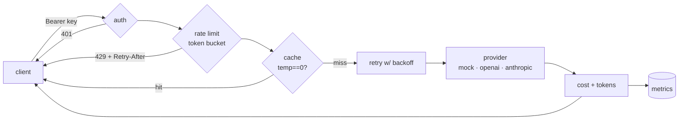

# llm-gateway

[](https://github.com/egnaro9/llm-gateway/actions/workflows/ci.yml)
[](https://www.python.org/)
[](https://fastapi.tiangolo.com/)
[](https://egnaro9.github.io/llm-gateway/)
[](LICENSE)

**A multi-provider LLM gateway on FastAPI — auth, rate limiting, caching, retries, and per-model cost accounting behind one OpenAI-shaped endpoint.**

Calling an LLM provider directly from your app means every service re-implements the same cross-cutting concerns: keys, retries, spend tracking, a per-tenant rate limit, a cache. This gateway centralizes them. Point your clients at one `POST /v1/chat/completions`; it routes by model to OpenAI, Anthropic, or a built-in **deterministic mock** — and the mock path means the whole thing **runs, is tested, and is cost-accounted with no API key and zero real spend.**

```
        ┌── auth ── rate-limit ── cache ── retry ── cost accounting ── metrics ──┐
client ─┤                                                                        ├─► provider
        └────────────────────  POST /v1/chat/completions  ──────────────────────┘
```

- **One OpenAI-compatible API, many backends.** Route `gpt-*` → OpenAI, `claude-*` → Anthropic, `mock*` → offline mock, by model-id prefix.
- **Everything a raw SDK doesn't give you:** Bearer-key auth, per-key **token-bucket rate limiting** (429 + `Retry-After`), an **LRU response cache** (identical deterministic prompts skip the provider), **exponential-backoff retries**, **per-model token + USD cost accounting**, a `/metrics` endpoint, and structured JSON request logs with a request id.
- **Deterministic & offline by default.** The mock provider makes the test suite fast, free, and reproducible. **22 tests, green CI, no secrets.**

### ▶ [Poke the gateway in your browser](https://egnaro9.github.io/llm-gateway/)

The real FastAPI app, running client-side via [Pyodide](https://pyodide.org). Send the same request twice and watch the cache take over; strip the API key for a 401; flood it for a 429 with `Retry-After`; hit `mock-flaky` and watch the retry ride out two failures. A browser can't listen on a socket, so the page speaks **ASGI to the app directly** — the same thing uvicorn does, minus the network.

---

## How a request flows



## Quickstart — no key required

```bash
git clone https://github.com/egnaro9/llm-gateway && cd llm-gateway
pip install -e ".[dev]"

python -m llmgateway.cli demo      # drives the gateway offline, prints metrics
# or serve it:
uvicorn llmgateway.app:app --reload
```

```bash
curl -s localhost:8000/v1/chat/completions \
  -H "Authorization: Bearer dev-key" -H "content-type: application/json" \
  -d '{"model":"mock-1","messages":[{"role":"user","content":"hello gateway"}]}' | jq
```
```json
{
  "model": "mock-1", "provider": "mock",
  "choices": [{"index": 0, "message": {"role": "assistant",
    "content": "You said: 'hello gateway'. (mock provider, 2 input tokens)"},
    "finish_reason": "stop"}],
  "usage": {"prompt_tokens": 2, "completion_tokens": 9, "total_tokens": 11},
  "cost_usd": 0.0, "cached": false, "latency_ms": 0.31
}
```

Send the **same** request again → `"cached": true` and the provider is never touched. Interactive OpenAPI docs are at `/docs`.

## Endpoints

| Method & path | Purpose |
| --- | --- |
| `POST /v1/chat/completions` | Chat completion (auth); supports `stream: true` via SSE |
| `GET /v1/models` | Registered models, their provider, and per-1K pricing |
| `GET /metrics` | Aggregate usage: requests, cache-hit rate, tokens, USD, per-model |
| `GET /health` | Liveness + version |

## The cross-cutting concerns, and where they live

| Concern | Module | Notes |
| --- | --- | --- |
| Auth | [`app.py`](llmgateway/app.py) `require_api_key` | Bearer key checked against `GATEWAY_API_KEYS` |
| Rate limiting | [`ratelimit.py`](llmgateway/ratelimit.py) | Per-key token bucket, injectable clock → deterministic tests; Redis-swappable |
| Caching | [`cache.py`](llmgateway/cache.py) | LRU keyed on `sha256(model+messages+max_tokens)`; only `temperature==0` is cached |
| Retries | [`retry.py`](llmgateway/retry.py) | Exponential backoff; `mock-flaky` fails twice then succeeds to prove it |
| Cost accounting | [`pricing.py`](llmgateway/pricing.py) | Per-model $/1K table → USD per request, aggregated in `/metrics` |
| Persistence | [`store.py`](llmgateway/store.py) | Optional SQLAlchemy 2.0 usage table + Alembic migration; `/metrics` aggregates from it when `GATEWAY_DATABASE_URL` is set, else in-memory |
| Providers | [`providers.py`](llmgateway/providers.py) | `provider_name` is pure (list models with no key); real clients instantiate lazily |

## Enabling real providers

```bash
pip install -e ".[openai,anthropic]"
export OPENAI_API_KEY=sk-...
export ANTHROPIC_API_KEY=sk-ant-...
# now `"model": "gpt-4o-mini"` or `"model": "claude-haiku-4-5"` routes to the real API
```
No code change — routing is by model-id prefix. The optional SDKs are imported only when a request actually hits that provider, so a missing key never breaks the offline path.

## Configuration (env)

| Var | Default | |
| --- | --- | --- |
| `GATEWAY_API_KEYS` | `dev-key` | comma-separated valid Bearer keys |
| `GATEWAY_RATE_CAPACITY` | `60` | bucket size per key |
| `GATEWAY_RATE_REFILL` | `1.0` | tokens/sec refill |
| `GATEWAY_CACHE_SIZE` | `512` | LRU entries |
| `GATEWAY_DATABASE_URL` | *(unset)* | persist usage & aggregate `/metrics` from a DB (SQLAlchemy URL, e.g. `sqlite:///gateway.db` or `postgresql+psycopg://…`); unset → in-memory |

Persistence is opt-in — install it with `pip install -e ".[sql]"`, then:

```bash
export GATEWAY_DATABASE_URL=sqlite:///gateway.db
alembic upgrade head           # create the usage table (production path)
```

## Run it in Docker

```bash
docker compose up --build      # gateway on :8000, health check, usage persisted to a volume
```

## Design notes

- **Why a mock provider?** So the gateway's *own* logic — auth, limiting, caching, retry, accounting — is testable in isolation from any network. The suite is deterministic and needs no keys, which is also what keeps CI free and green.
- **Why cache only `temperature == 0`?** Caching a sampled (nondeterministic) completion would return one user's roll of the dice to another. Determinism is the correctness precondition for caching.
- **Scaling path.** The rate limiter and cache are process-local by design (simple, fast, zero-dependency). The interfaces are the same ones you'd back with Redis for a multi-instance deployment — that's the only change needed.
- **Metrics: in-memory by default, a table when you want it.** `/metrics` counts in a locked dict — all the offline demo can do, since its wheel ships without an ORM. Set `GATEWAY_DATABASE_URL` and the same numbers instead come from a `GROUP BY` over a per-request usage table (SQLAlchemy 2.0 + one Alembic migration), so they survive a restart and add up across instances. The store is imported lazily, so the default path never loads SQLAlchemy. See [`store.py`](llmgateway/store.py).

```
llmgateway/
  app.py        FastAPI factory: routes, auth, middleware, metrics
  providers.py  Router + MockProvider (deterministic) + OpenAI/Anthropic (optional)
  ratelimit.py  per-key token bucket (injectable clock)
  cache.py      LRU response cache keyed on the semantic request
  retry.py      exponential-backoff retry
  pricing.py    per-model $/1k table + cost()
  store.py      optional SQLAlchemy usage table (metrics that persist)
  schemas.py    Pydantic request/response models (also the OpenAPI schema)
  cli.py        `serve` (uvicorn) · `demo` (offline)
tests/          22 tests — API, auth, cache, rate limit, cost, retry, streaming
```

---

Built by [Erik Hill](https://egnaro9.github.io) · MIT licensed.
